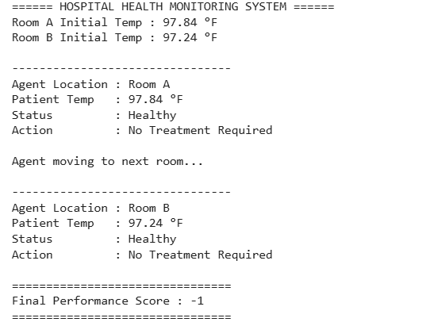

<h1>ExpNo 1 :Developing AI Agent with PEAS Description</h1>
<h3>Name: Saravanan N</h3>
<h3>Register Number/Staff Id: TSML006</h3>


<h3>AIM:</h3>
<br>
<p>To find the PEAS description for the given AI problem and develop an AI agent.</p>
<br>
<h3>Theory</h3>
<h3>Medicine prescribing agent:</h3>
<p>Such this agent prescribes medicine for fever (greater than 98.5 degrees) which we consider here as unhealthy, by the user temperature input, and another environment is rooms in the hospital (two rooms). This agent has to consider two factors one is room location and an unhealthy patient in a random room, the agent has to move from one room to another to check and treat the unhealthy person. The performance of the agent is calculated by incrementing performance and each time after treating in one room again it has to check another room so that the movement causes the agent to reduce its performance. Hence, agents prescribe medicine to unhealthy.</p>
<hr>
<h3>PEAS DESCRIPTION:</h3>
<table>
  <tr>
    <td><strong>Agent Type</strong></td>
    <td><strong>Performance</strong></td>
     <td><strong>Environment</strong></td>
    <td><strong>Actuators</strong></td>
    <td><strong>Sensors</strong></td>
  </tr>
    <tr>
    <td><strong>Medicine prescribing agent</strong></td>
    <td><strong>Treating unhealthy, agent movement</strong></td>
     <td><strong>Rooms, Patient</strong></td>
    <td><strong>Medicine, Treatment</strong></td>
    <td><strong>Location, Temperature of patient</strong></td>
  </tr>
</table>
<hr>
<H3>DESIGN STEPS</H3>
<h3>STEP 1:Identifying the input:</h3>
<p>Temperature from patients, Location.</p>
<h3>STEP 2:Identifying the output:</h3>
<p>Prescribe medicine if the patient in a random has a fever.</p>
<h3>STEP 3:Developing the PEAS description:</h3>
<p>PEAS description is developed by the performance, environment, actuators, and sensors in an agent.</p>
<h3>STEP 4:Implementing the AI agent:</h3>
<p>Treat unhealthy patients in each room. And check for the unhealthy patients in random room</p>
<h3>STEP 5:</h3>
<p>Measure the performance parameters: For each treatment performance incremented, for each movement performance decremented</p>

## PROGRAM
```py
import random

class MedicinePrescribingAgent:
    def __init__(self):
        self.current_location = "Room A"
        self.performance = 0

    def check_room(self, rooms):
        temperature = rooms[self.current_location]

        print("\n--------------------------------")
        print(f"Agent Location : {self.current_location}")
        print(f"Patient Temp   : {temperature:.2f} °F")

        if temperature > 98.5:
            print("Status         : Unhealthy (Fever Detected)")
            print("Action         : Medicine Prescribed")
            self.performance += 1
        else:
            print("Status         : Healthy")
            print("Action         : No Treatment Required")

    def move(self):
        print("\nAgent moving to next room...")
        self.performance -= 1

        if self.current_location == "Room A":
            self.current_location = "Room B"
        else:
            self.current_location = "Room A"

    def show_performance(self):
        print("\n================================")
        print(f"Final Performance Score : {self.performance}")
        print("================================")


if __name__ == "__main__":

    rooms = {
        "Room A": random.uniform(97.0, 102.0),
        "Room B": random.uniform(97.0, 102.0)
    }

    print("====== HOSPITAL HEALTH MONITORING SYSTEM ======")
    print(f"Room A Initial Temp : {rooms['Room A']:.2f} °F")
    print(f"Room B Initial Temp : {rooms['Room B']:.2f} °F")

    agent = MedicinePrescribingAgent()

    agent.check_room(rooms)

    agent.move()

    agent.check_room(rooms)

    agent.show_performance()
```

### Output:



### Result

Hence, the solution for the given AI problem is found.